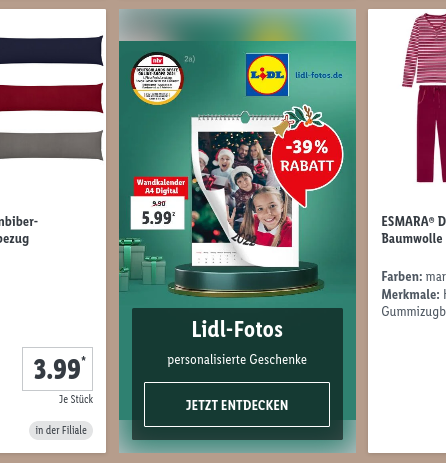

# lidl-de-enhancements

Enhancements for the lidl.de shop

## Features

-   Filter articles based on availability (only online, only offline in stores)
-   Hide ads/teasers in article listings

## Screenshots

### Filter online/offline articles

The article view always shows online and offline articles together (usually with
a lot more online-only articles). This is annoying if you just want to know
what your local store has on offer this week.

||
|-|

With this extension you can filter the article list for online and offline
articles.

||
|-|

### Ads/Teasers

There are often ads/teasers for related articles and offers in
the article listing. I think they're annoying so I decided to hide them.

||
|-|

||
|-|
