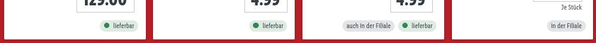

# lidl-de-enhancements

Enhancements for the lidl.de shop

## Install

* Firefox: Get it from [addons.mozilla.org](https://addons.mozilla.org/en-US/firefox/addon/lidl-de-enhancements/)
* Chromium:
  * Download the `*.crx` file of the the
    [latest release](https://github.com/jlieth/lidl-de-enhancements/releases/latest/download/lidl-de-enhancements.crx)
    (your browser may display a warning message about the type of the file)
  * Open the extension manager by visiting [chrome://extensions/](chrome://extensions/)
  * Open a file browser, navigate to the directory you downloaded the
    `*.crx` file to and drag&drop the file into your browser window
    (you may have to activate Developer Mode for drag&drop to work)
  * The browser should show a window prompting you to install the extension

**NOTE for Chrome:** This will **not** work in standard Chrome.
Chrome expects all extensions to be signed by the Chrome Web Store and
refuses to install extensions from other sources.

**NOTE for Ungoogled Chromium:** Installation should work about the same
as in vanilla Chromium. Refer to the [wiki](https://ungoogled-software.github.io/ungoogled-chromium-wiki/faq#installing-the-crx-file)
on installing `*.crx` files if you run into trouble. I **highly** recommend
[chromium-web-store](https://github.com/NeverDecaf/chromium-web-store)
which enables autoupdates for addons.

## Features

-   Filter articles based on availability (only online, only offline in stores)
-   Hide ads/teasers in article listings

## Screenshots

### Filter online/offline articles

The article view always shows online and offline articles together (usually with
a lot more online-only articles). This is annoying if you just want to know
what your local store has on offer this week.

||
|-|

With this extension you can filter the article list for online and offline
articles.

||
|-|

### Ads/Teasers

There are often ads/teasers for related articles and offers in
the article listing. I think they're annoying so I decided to hide them.

||
|-|

||
|-|
